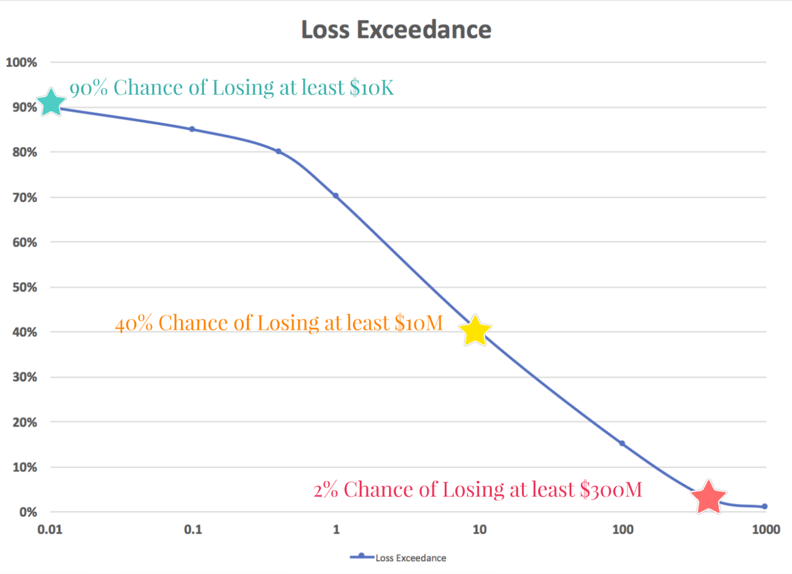
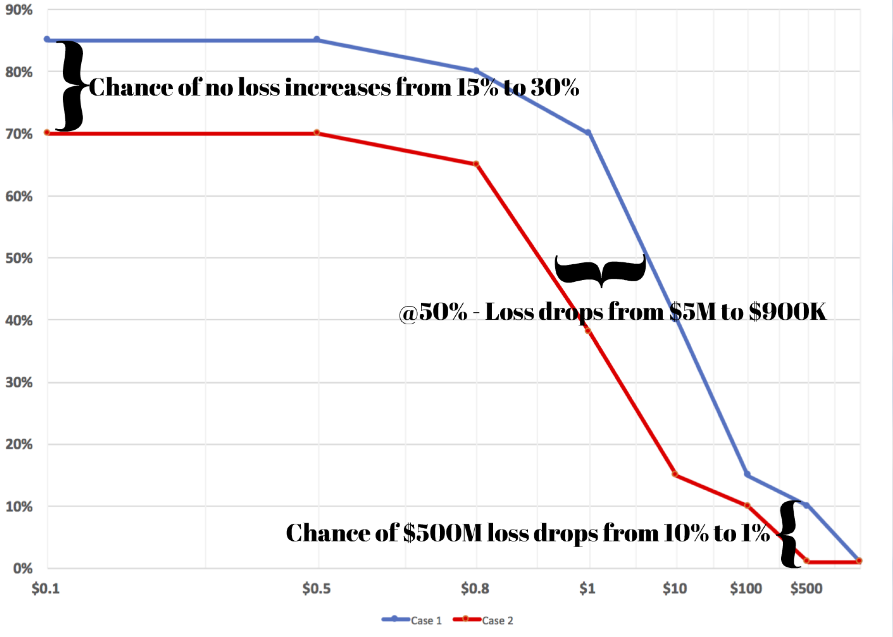
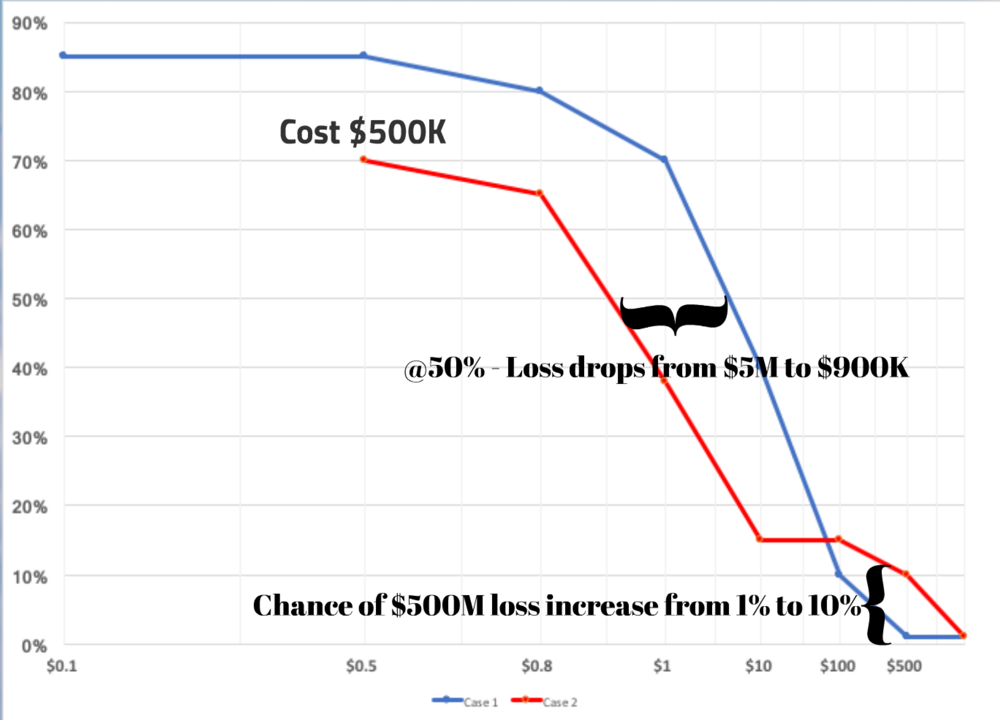

# Cyber Risk Economics
paying around markdown vs wiki

Cybersecurity spending 2017-2021 is expected to total over 1 trillion dollars (reference https://cybersecurityventures.com/cybersecurity-market-report/). That money is being spend to reduce the risk of losing even more. Yet most spend decisions are made via FUD (Fear, Uncertainly, Doubt) as opposed to rational business logic.

This page is an attempt to summarize the key concepts of the book How to measure anything in cybersecurity risk by Hubbard & Seiersen which can be found here. Note this book is used as a textbook in a semester long course, so this summary will not do it justice.

I didn't particularly like their writing style but they make some really valuable points.

Until I put in a writeup, 
you can listen to me babble for ~5 min 
in a talk I gave to a software conference at (2:10 to 5:30) & (35:50 to 38:20) in:

 * Video 2:10-5:30 ie 3 min 20 sec starting [here](https://youtu.be/NYkwvVKlbU8?t=2m10s)
 * Video 35:50-38:20 ie 2 min 30 sec starting [here](https://youtu.be/NYkwvVKlbU8?t=2m10s)
 * https://youtu.be/NYkwvVKlbU8?t=35m50s

I won't say listening to me babble for 5 minutes will replace reading the book, but it will give you a couple of highlights and maybe get you to look into it further.

We can learn a lot about risk from other fields. 
"there are plenty of fields with massive risk, minimal data, 
and profoundly chaotic actors that are regularly modeled 
using traditional mathematical models" (ref Hubbard)

The book is about applying that math & science to cyber. 
A lot of the book is about how to remove cognitive bias 
to turn ‘subjective’ into 'objective'. 
We spend money to reduce risk and the authors 
show how everything can be measured in monetary terms. 
In particular something called a loss exceedance curve.

The purple says that there is 90% chance you will lose at least 10 thousand dollars due to cyber in the next year.

The blue says that there is 50% chance you will lose at least
5 million dollars due to cyber in the next year.
Note it’s a log scale

The red says that there is 1% chance you will lose at least
500 million dollars due to cyber in the next year.

Note whether this is a ‘good’ chart or a ‘bad’ chart depends on your company. To many smaller companies this would be horrible.
However a large bank might love to have it this good.

I’ll show how to use this for comparing alternatives later in the talk.

I mentioned we’d talk about the CIA after money.
In infosec, CIA stands for

